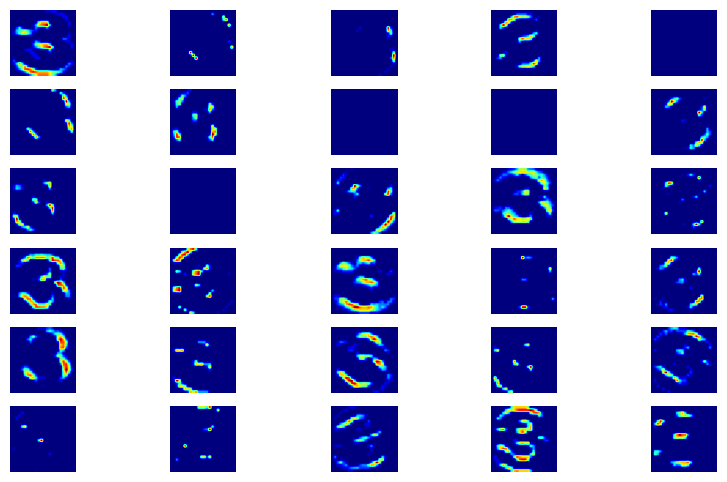
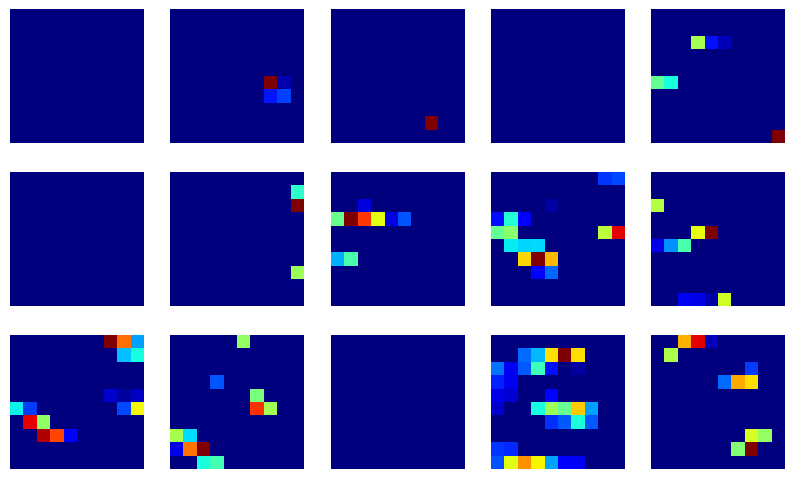

# LeNet CNN for MNIST Classification

This project implements a LeNet-based Convolutional Neural Network (CNN) using Keras to classify handwritten digits from the MNIST dataset. The model is trained, evaluated, and used to predict digits, with visualizations of the intermediate convolutional layers.

## Project Structure

- **Load and Preprocess Data**: The MNIST dataset is loaded, reshaped, and normalized.
- **Visualize Dataset**: A sample of images from each digit class is displayed, and the distribution of training images across classes is plotted.
- **LeNet Model**: A CNN is built based on the LeNet architecture to classify digits. The architecture includes:
  - Two convolutional layers
  - Two max-pooling layers
  - Dropout for regularization
  - Fully connected layers and softmax output
- **Model Training**: The model is trained on the MNIST training data.
- **Model Evaluation**: Training/validation accuracy and loss are plotted. The model is evaluated on test data for accuracy and loss.
- **Class Prediction**: The model predicts a class for an external image by preprocessing it and running the prediction.
- **Visualizing Layers**: The outputs from the first and second convolutional layers are visualized.

## Installation and Dependencies

To run this project, you need the following dependencies:

- Python 3.x
- NumPy
- Matplotlib
- Keras
- TensorFlow
- PIL
- OpenCV

Install the dependencies using pip:

```bash
pip install numpy matplotlib keras tensorflow pillow opencv-pytho
```

## Dataset
The project uses the MNIST dataset, which contains 70,000 28x28 grayscale images of handwritten digits (0-9), split into 60,000 training and 10,000 test images.

## Code Overview

### Load and Preprocess Data
First, the dataset is loaded, reshaped into 28x28x1 (grayscale format), and normalized by dividing by 255 to scale pixel values between 0 and 1.

```python
(X_train, y_train), (X_test, y_test) = mnist.load_data()

X_train = X_train.reshape(60000, 28, 28, 1)
X_test = X_test.reshape(10000, 28, 28, 1)

X_train = X_train / 255
X_test = X_test / 255

y_train = to_categorical(y_train, 10)
y_test = to_categorical(y_test, 10)
```

## Visualizing the Dataset
A sample of images from each digit class is displayed using matplotlib. The distribution of training data across the 10 digit classes is also plotted.

```python
cols = 5
num_classes = 10
fig, axs = plt.subplots(nrows=num_classes, ncols=cols, figsize=(5,10))
fig.tight_layout()

for i in range(cols):
    for j in range(num_classes):
        x_selected = X_train[y_train == j]
        axs[j][i].imshow(x_selected[random.randint(0, len(x_selected) - 1)], cmap=plt.get_cmap('gray'))
        axs[j][i].axis("off")

plt.figure(figsize=(12, 4))
plt.bar(range(0, num_classes), num_of_samples)
plt.title("Distribution of the train dataset")
plt.xlabel("Class number")
plt.ylabel("Number of images")
plt.show()
```

## LeNet Model Definition
The LeNet model is built using Keras' Sequential API. It consists of two convolutional layers, max-pooling layers, a fully connected layer, and a softmax output.

```python
def leNet_model():
    model = Sequential()
    model.add(Conv2D(30, (5, 5), input_shape=(28, 28, 1), activation='relu'))
    model.add(MaxPooling2D(pool_size=(2, 2)))
    model.add(Conv2D(15, (3, 3), activation='relu'))
    model.add(MaxPooling2D(pool_size=(2, 2)))
    model.add(Flatten())
    model.add(Dense(500, activation='relu'))
    model.add(Dropout(0.5))
    model.add(Dense(num_classes, activation='softmax'))
    model.compile(Adam(learning_rate=0.01), loss='categorical_crossentropy', metrics=['accuracy'])
    return model

model = leNet_model()
print(model.summary())
```

## Model Training
The model is trained for 10 epochs using the Adam optimizer and categorical cross-entropy loss.

```python
history = model.fit(X_train, y_train, epochs=10, validation_split=0.1, batch_size=400, verbose=1, shuffle=1)
```

## Plotting Loss and Accuracy
The loss and accuracy for both training and validation data are plotted using matplotlib.

```python
plt.plot(history.history['loss'])
plt.plot(history.history['val_loss'])
plt.legend(['loss', 'val_loss'])
plt.title('Loss')
plt.xlabel('Epoch')
plt.show()

plt.plot(history.history['accuracy'])
plt.plot(history.history['val_accuracy'])
plt.legend(['accuracy', 'val_accuracy'])
plt.title('Accuracy')
plt.xlabel('Epoch')
plt.show()
```

## Class Prediction from External Image
An external image is loaded and preprocessed into the correct input shape (28x28 grayscale), then the model predicts its class.

```python
import requests
from PIL import Image
url = 'https://printables.space/files/uploads/download-and-print/large-printable-numbers/3-a4-1200x1697.jpg'
response = requests.get(url, stream=True)
img = Image.open(response.raw)

import cv2
img_array = np.asarray(img)
resized = cv2.resize(img_array, (28, 28))
grayscale = cv2.cvtColor(resized, cv2.COLOR_BGR2GRAY)
image = cv2.bitwise_not(grayscale)
plt.imshow(image, cmap='gray')
image = image.reshape(1, 28, 28, 1)
prediction = model.predict(image)
print(f'Predicted digit: {np.argmax(prediction)}')
```

## Visualizing Convolutional Layers
To understand the feature extraction process, the outputs of the first and second convolutional layers are visualized.

```python
# obtain inputs and outputs of first convolutional layer
layer1 = Model(inputs = model.layers[0].input, outputs = model.layers[0].output)
# obtain inputs and outputs of second convolutional layer
layer2 = Model(inputs = model.layers[0].input, outputs = model.layers[2].output)

visual_layer1, visual_layer2 = layer1.predict(image), layer2.predict(image)
print(visual_layer1.shape)
print(visual_layer2.shape)

plt.figure(figsize=(10,6))
for i in range(30):
    plt.subplot(6, 5, i+1)
    plt.imshow(visual_layer1[0, :, :, i], cmap=plt.get_cmap('jet'))
    plt.axis('off')

plt.figure(figsize=(10,6))
for i in range(15):
    plt.subplot(3, 5, i+1)
    plt.imshow(visual_layer2[0, :, :, i], cmap=plt.get_cmap('jet'))
    plt.axis('off') 
```

   

## Results
The model achieves high accuracy on the MNIST test dataset, correctly classifying most digits. The convolutional layer visualizations demonstrate how the network extracts relevant features for classification.

## Conclusion
This project showcases the use of a LeNet CNN architecture for digit classification using the MNIST dataset. The model can be further tuned or extended for more complex image classification tasks.
